# 可穿戴肌电臂环实时控制外部设备系统

## 项目简介
本项目是一个基于可穿戴肌电臂环的机械臂控制系统。通过采集人体手臂的肌电信号，经过信号处理和模式识别，实现对机械臂的实时控制。项目采用模块化设计，包含信号采集、处理、模型训练和控制等多个环节。

## 课题背景
如今，肌电信号控制技术因其在生物医学工程、人机交互以及智能假肢等领域的广泛应用而备受关注。肌电信号（Electromyography, EMG）是肌肉活动时产生的生物电信号，通过捕捉这些信号，可以解读人的意图，进而控制外部设备。这种技术尤其对于失去肢体功能的人群来说，提供了一种通过思维直接控制假肢或辅助设备的可能性，极大地提高了他们的生活质量。

此外，肌电控制技术在工业自动化领域也展现出巨大潜力。传统的机械臂控制依赖于预设程序或人工操作，而肌电信号控制技术可以使机械臂的操作更加灵活、直观，甚至能够模仿人类手臂的自然动作，这对于提高生产效率和操作精度具有重要意义。

本项目聚焦于 EMGRPO 8 通道肌电臂环的开发，该臂环能够捕捉表面肌电信号，并将数据传输给上位机。本项目通过设计信号处理与模式识别方案，将采集到的表面肌电信号其转化为控制机械臂的具体指令。研究者希望通过这种方式实现更自然、更直观的人机交互，同时推动肌电控制技术在辅助残障人士和工业自动化等领域的实际应用。项目的成功实施将为肌电信号处理和识别算法的发展提供新的视角，同时也为机械臂的智能化控制开辟新的道路。

## 实验设置

### 臂环及其佩戴位置
基于 EMGRPO 8 通道肌电臂环电极片分布结构<sup>\[[图1](#fig1)\]</sup>，本研究在有限的采集频率和传输效率下尽可能提高数据的特征性与有效性。经查证，将 8 通道肌电臂环戴在**肱骨桡关节的矢状面处**<sup>\[[图2](#fig2)\]</sup>能够获取前臂近端肌肉的密集采样<sup>\[[1](#cite1)\]</sup>，能够最大效率地采集到有效肌电数据。在实际测试中，此位置也能保证电极片尽可能紧贴皮肤表面，波形可视化结果最为明显<sup>\[[图3](#fig3)\]</sup>。

<table>
  <tr>
    <td align="center">
      <a name="fig1"></a>
      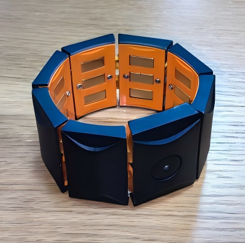<br/>
      <strong>图 1</strong> EMGRPO 8 通道肌电臂环
    </td>
    <td align="center">
      <a name="fig2"></a>
      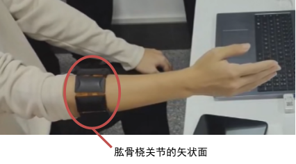<br/>
      <strong>图 2</strong> EMGRP 电极片采样位置——肱骨桡关节的矢状面
    </td>
  </tr>
</table>

<a name="fig3"></a>
<div align="center">
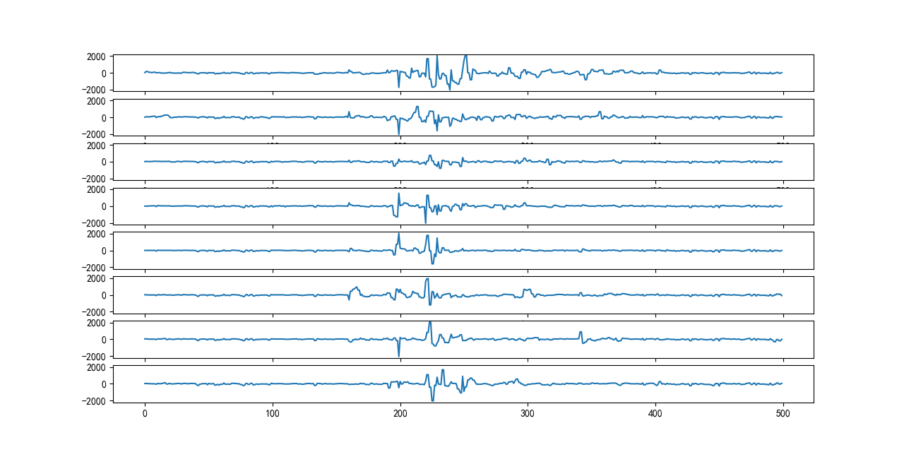<br/>
<strong>图 3</strong> 8 通道肌电波形图
</div>

### 数据传输与解析
数据传输使用了 Serial 库实现直接从串口读取二进制数据，有效降低了响应时间，同时避免了读写冲突造成的数据丢失。

臂环本身提供了两种不同[数据格式](https://sichiray-tech.yuque.com/dm0eyv/chanpin/bflmvgotg46wszkm#TetWZ)的传输方式，其中一种数据格式相对复杂，包含时间戳、陀螺仪、电池电量等多个数据，而传输频率能达到 500Hz，即每秒传输 500 个 8 通道 EMG 采样点，但采集精度较低，分辨率仅 128 位；而另一种数据格式只传输 EMG 信号，传输频率仅 50Hz，即每秒只传输 50 个 8 通道 EMG 采样点，但采集精度较高，分辨率能达到 2048 位。两种传输方式的综合测试结果表明，尽管纯肌电采样频率低，但能获得更准确的波形，因此最终选择以纯肌电方式传输数据。

在这种传输方式下选择每 0.2 秒读取一个样本序列（10 个采样点），同时调用 keyboard 库监听键盘，在键盘上按下的按键即为标签，它将与同一时间获得的样本序列对齐，共同作为一个先验样本点进入数据存储区。收集先验数据过程中，**只需要在做动作的同时按下键盘按键就能标记兴趣片段，极大地便捷了训练样本的采集**。

### 信号处理与模式识别

**路径一：人工特征提取 + SVM 支持向量机**

历史研究表明，肌电信号的核心表征包括统计特征、时域特征和频域特征<sup>\[[2](#cite2)\]\[[3](#cite3)\]\[[4](#cite4)\]</sup>。据此，本节设计的算法如下：

首先从每个通道的 EMG 数据提取如下特征：
* 统计特征：包括 IEMG（积分肌电值，表征时段内肌肉收缩特性，随着疲劳程度的加深而增加），RMS（均方根，表征肌肉收缩强度），MAV（平均绝对值，表征肌肉收缩强度和疲劳程度，但对高频噪声的影响更小）;
* 时域特征：包括 ZC（过零率，表征肌肉状态）、WL（波形长度，表征肌电信号的复杂度）、SSC（斜率符号变化，表征肌电信号即将发生波动变化的状态）;
* 频域特征：包括 MF（中值频率，表征肌肉收缩的力量）、MPF（均值频率，表征肌肉收缩的力量，抗混叠能力较好）。

然后将 8 通道 EMG 的特征值构建为 8x8 的特征矩阵，将其展平为 1x64 的数组后作为 SVM 支持向量机的输入，尝试根据不同的数据特征对其进行分类。

在这个过程中，数据展平操作破坏了数据的原始结构，削弱了其特征性；而且在核函数的选取中，线性核对参数的敏感性会导致模型性能的显著变化，同时 SVM 在处理复杂的非线性关系时缺乏灵活性，不能将数据映射到高维空间以寻找更复杂的决策边界，因而模型的类隔离效果不佳，识别准确率低于 20% 。同时，提取特征尤其是频域特征所需时间较长（>2s），大大削弱了实时性。在多次尝试优化后仍然效果不佳，最终被放弃。

**路径二：时频图提取构建 RGB-image + 图像识别模型**

参考另一通过对 ECG 心电信号深度学习以检测心脏问题的相关研究<sup>\[[5](#cite5)\]</sup>，研究者设计了如下的 EMG 信号识别方案：

首先对收集到的 EMG 序列信号进行短时傅里叶变换（STFT）与连续小波变换（CWT）以得到两份时频图。STFT 时频图能够提供信号在时间和频率上的局部信息，适用于分析非平稳信号。CWT 时频图同时提供时间和频率信息，特别适合于分析具有不同时间尺度特征的信号。

然后将 STFT 时频图、CWT 时频图与原始 EMG 频率-振幅图分别作为红色通道、绿色通道与蓝色通道信息组合起来，构建一个 RGB 图像，再调用成熟的图像识别模型对图像特征做提取分类。但在实践中研究者发现，仅仅要获得 1s 内（50 个采样点）的 RGB图像就需要运行超过 15s，远远不能满足我们对时效性的要求。

**路径三：CNN 神经网络模型**

由基于 EEG 脑电信号研究视觉与听觉刺激效果<sup>\[[6](#cite6)\]</sup>的研究启发，参考案例中的脑电分类模型，研究者设计了 CNN 神经网络模型并针对 EMG 信号特点选取了合适的模型参数，取得了出色的识别效果。

*模型结构*<sup>\[[图4](#fig4)\]</sup>：神经网络模型有一个输入层、两个卷积块、一个扁平化层和一个全连接层，其中每个卷积块包含卷积层、批量归一化层、激活层、平均池化层、正则化层，第一个卷积块包含深度可分离卷积层。

<a name="fig4"></a>
<div align="center">
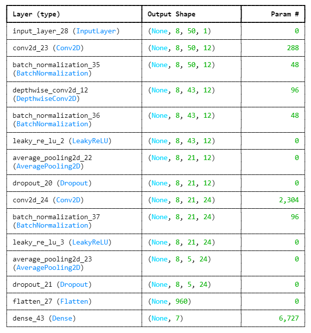<br/>
<strong>图 4</strong> 模型结构
</div>

*训练策略*：模型使用 Adam 优化器进行训练，损失函数采用分类交叉熵。

*模型评估*：为进一步优化模型识别准确率，研究针对激活函数的种类、优化器的种类等多个参数展开实验，力图找到更优的识别模型。主要考量的评价参数包括：
* 准确率（Accuracy）是最直观的性能评估指标，即模型正确预测的样本占所有样本的比例；
* 精确率（Precision）衡量的是模型预测为正类别的样本中，实际为正类别的比例；
* 召回率（Recall）衡量的是实际正类别样本中，模型正确预测为正类别的比例；
* F1 分数（F1-Score）是精确率和召回率的调和平均值，旨在综合考虑这两个指标的表现。

为了尽可能提高对特定手势的敏感度，最终得分（final_score）为以下指标的平均值：
* 空闲手势（idle）的召回率 recall_idle；
* 六类手势（标记为 a、d、w、s、q、e）的精确率 precision_X；
* 最终 F1 分数 f1_score_accuracy。

以下<sup>\[[图5](#fig5)\]\[[表1](#tab1)\]</sup>为针对六类主流激活函数 ELU(alpha=1.0)、PReLU、ReLU、LeakyReLU(alpha=0.01)、Swish、GELU 对模型影响的试验结果：（无关变量控制：使用同一先验样本集，第一卷积块 12 个 1x24 卷积核，第二卷积块 24 个 1x8 卷积核形状，dropoutRate=0.4，正则化率=0.75，Adam 优化器）

<a name="fig5"></a>
<div align="center">
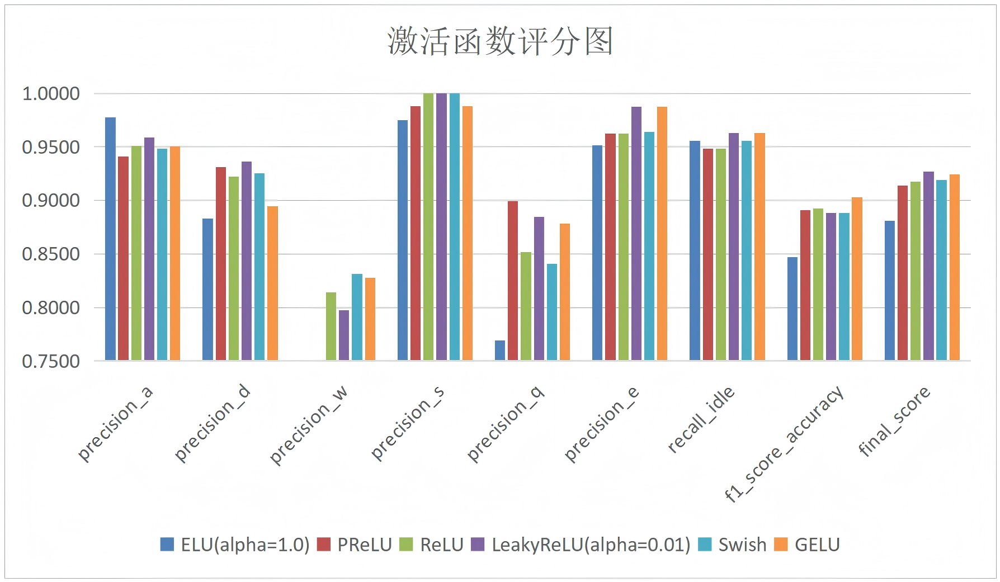<br/>
<strong>图 5</strong> 激活函数评分图
</div>

<a name="tab1"></a> 
<div align="center"><strong>表 1</strong> 激活函数评分表</div>

| Metric | ELU (alpha=1.0) | PReLU | ReLU | LeakyReLU (alpha=0.01) | Swish | GELU |
|--------|-----------------|-------|------|------------------------|-------|------|
| precision_a | 0.9777 | 0.9412 | 0.9509 | 0.9589 | 0.9482 | 0.9504 |
| precision_d | 0.8829 | 0.9314 | 0.9224 | 0.9362 | 0.9254 | 0.8945 |
| precision_w | 0.6885 | 0.7496 | 0.8143 | 0.7976 | 0.8315 | 0.8280 |
| precision_s | 0.9749 | 0.9882 | 1.0000 | 1.0000 | 1.0000 | 0.9882 |
| precision_q | 0.7691 | 0.8993 | 0.8517 | 0.8846 | 0.8410 | 0.8786 |
| precision_e | 0.9515 | 0.9625 | 0.9625 | 0.9875 | 0.9640 | 0.9875 |
| recall_idle | 0.9556 | 0.9481 | 0.9481 | 0.9630 | 0.9556 | 0.9630 |
| f1_score_accuracy | 0.8471 | 0.8912 | 0.8926 | 0.8882 | 0.8882 | 0.9029 |
| final_score | 0.8809 | 0.9140 | 0.9178 | **0.9270** | 0.9192 | 0.9241 |

结果<sup>\[[图5](#fig5)\]\[[表1](#tab1)\]</sup>表明，综合得分最高的 LeakyReLU 函数最适合作为激活函数，其余参数的测试与选择方案与以上类似。综合多个参数测试结果后，最终采用的核心参数如下：

第一卷积块：12 个 1x24 卷积核，激活函数 LeakyReLU，1x2 平均池化，dropoutRate=0.4

第二卷积块：24 个 1x8 卷积核，激活函数 LeakyReLU，1x4 平均池化，dropoutRate=0.4

正则化率=0.75，采用 Adam 优化器（learning_rate=0.001, beta_1=0.9, beta_2=0.999）

多次测试结果<sup>\[[表4](#tab4)\]</sup>表明，上述模型的准确率高于 90%，说明模型整体正确分类的能力很强，识别大多数手势时，预测正确。召回率基本高于 85%，说明模型能识别出大部分手势。**综合最终得分稳定超过 90%**，表明模型的整体表现非常好，不仅准确性高，且在不同类别的识别上都表现优秀。

### 分类判别
在模型预训练完成后开展正式识别。程序每 0.2 秒读取近 1 秒的数据，即一次读取 50 个采样点序列，每次更新 10 个采样点序列，然后将这批输入的数据将送入模型进行预测，模型根据这些数据进行分类。模型会输出每个类别的预测概率，在多个类别的预测概率中选择概率最高的类别作为本次输入的分类结果。同时持续监控多个连续的分类输出，只有当连续得到三个相同的分类结果时，才认为该结果可靠，并将其作为最终输出。尽管这使得最终延迟提升至 0.6s，但极大地提高了输出结果的可靠性，保障机械臂每次动作都能接收到正确的指令。

### 机械臂的控制

**动作控制原理**

机械臂采用树莓派 4B 加扩展板控制，以树莓派为主控，扩展版连接树莓派和机械臂舵机，搭配树莓派主控下能更好的进行二次开发与拓展。机械臂的运动由多个舵机驱动，这些舵机通过调整各自的角度来控制机械臂的各个关节，调整舵机角度基于脉冲宽度调制（PWM）信号。主板上安装的是 Debian 11 的系统，内置 Thoony，采用 Python3 编译器。通过 RPi.GPIO 库来生成 PWM 信号，这些信号通过树莓派的 GPIO 端口发送给舵机，从而控制机械臂的各个关节。

**识别结果传输方式**

机械臂与闭环之间采用局域网文件传输。首先在树莓派系统中使用 pyftpdlib 库创建 FTP 服务器，通过访问 FTP 服务器将模式识别的结果传输给树莓派，实现全自动，低延迟的控制效果。

### 动作设计
**手势选择**
 
EMG 动作识别相关研究<sup>\[[7](#cite7)\]</sup>表明，下列手势动作<sup>\[[表2](#tab2)\]\[[图6](#fig6)\]</sup>相对容易准确识别：

<a name="tab2"></a> 
<div align="center"><strong>表 2</strong> 17 种手势动作的具体信息

| <div align="center">序号</div> | <div align="center">动作描述</div> |
|:----:|----------|
| 1 | 伸出大拇指 |
| 2 | 伸出食指和中指 |
| 3 | 无名指和小拇指并拢，其余张开 |
| 4 | 大拇指并拢，其余张开 |
| 5 | 五指张开 |
| 6 | 握拳 |
| 7 | 食指外伸，其余并拢 |
| 8 | 五指并拢 |
| 9 | 五指张开，沿食指外转 |
| 10 | 五指张开，沿食指内转 |
| 11 | 五指并拢，沿小拇指内转 |
| 12 | 五指并拢，沿小拇指外转 |
| 13 | 手腕内屈 |
| 14 | 手腕外伸 |
| 15 | 手腕朝桡骨方向偏 |
| 16 | 手腕朝尺骨方向偏 |
| 17 | 握拳伸腕 |
</div>

<a name="fig6"></a>
<div align="center">
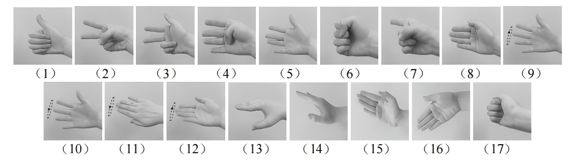<br/>
<strong>图 6</strong> 17 种手势动作具体图片
</div>

结合机械臂控制动作，本研究选取了其中部分手势（序号 1、2、3、5、6、9、10、11、12、13、14、15、16）以及部分额外手势开展识别度测试，测试结果发现动作的区分度有较大差异，对模型识别效果产生较大的影响；同时不同动作的准确率还具有较为明显的个体差异。因而在不同测试者使用时，建议选择个人准确率相对较高的手势作为识别目标进行训练，构建不同的标签对应关系。

**机械臂动作设计**

基于手部动作，本研究设计了 6 个机械臂动作：抬臂，垂臂，夹取，释放，左转，右转，与 6 个手势动作一一对应，最终实现垂臂，夹取方块，抬臂，右转，垂臂，释放方块，抬臂，转回原位的连贯动作，即通过手势远程控制机械臂进行简单的移动物品功能。

手势-标签-机械臂动作对应关系如下<sup>\[[表3](#tab3)\]</sup>：

<a name="tab3"></a> 
<div align="center"><strong>表 3</strong> 手势与机械臂动作对应关系

| 手势名称 | 手势展示 | 标签 | 机械臂动作 | 动作展示 |
|---------|----------|-----|-----------|----------|
| 左挥 | 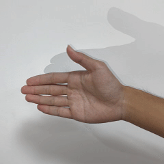 | a | 左转 | 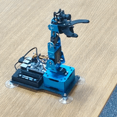 |
| 右挥 | 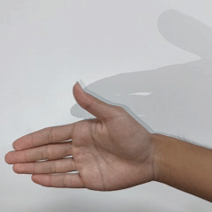 | d | 右转 | 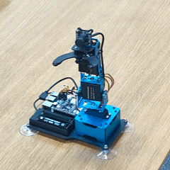 |
| 压手 |  | s | 垂臂 | 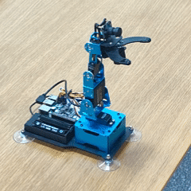 |
| 抬手 | 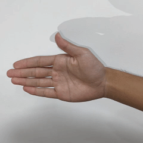 | w | 抬臂 | 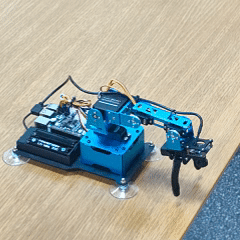 |
| 下指 |  | e | 夹取 | 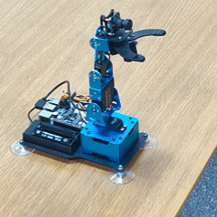 |
| 上指 | 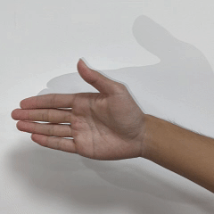 | q | 释放 | 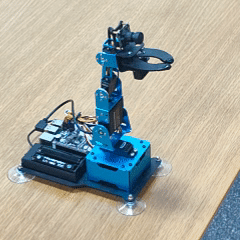 |
| 其他 | | IDLE | 保持静止 | |
</div>

## 实验结果
数据结果<sup>\[[表4](#tab4)\]</sup>表明，EMG 肌电信号通过肌电臂环和串口通讯能够实时、稳定、准确地采集与传输。CNN 神经网络模型在多次测试中，对选取的6个手势动作识别综合准确率能够控制在 90%-95% 的范围内，延时控制在 0.6s 以内，实现了根据输入的肌电信号准确、实时识别出动作意图。机械臂能够正确的接收到动作指令并准确完成预设动作。

<a name="tab4"></a> 
<div align="center"><strong>表 4</strong> CNN 神经网络模型识别效果

| Class | Precision | Recall | f1-score | Support |
|-------|-----------|--------|----------|---------|
| q（上指） | 0.91 | 1.00 | 0.95 | 20 |
| w（抬手） | 0.78 | 1.00 | 0.88 | 14 |
| e（下指） | 0.94 | 0.88 | 0.91 | 17 |
| a（左挥） | 0.95 | 0.83 | 0.89 | 24 |
| s（压手） | 1.00 | 1.00 | 1.00 | 16 |
| d（右挥） | 0.93 | 0.78 | 0.85 | 18 |
| IDLE（其他） | 0.89 | 0.93 | 0.91 | 27 |
| Accuracy | | | 0.91 | 136 |
| Macro avg | 0.91 | 0.92 | 0.91 | 136 |
| Weighted avg | 0.92 | 0.91 | 0.91 | 136 |
</div>

## 参考文献
<a name="cite1"></a>[1] 石磊. (2024). 基于多通道表面肌电信号的手部动作识别方法研究 [硕士学位论文]. 河南工业大学. P13

<a name="cite2"></a>[2] 津发科技. (2021, 九月 8). EMG 肌电信号测量与常用方法分析. https://zhuanlan.zhihu.com/p/408281822

<a name="cite3"></a>[3] 坊间小木匠. (2024, 四月 29). [归纳总结] 表面肌电信号 sEMG 之常用特征. CSDN 博客. https://blog.csdn.net/qq_43580646/article/details/128968949

<a name="cite4"></a>[4] 哥廷根数学学派. (2023, 五月 24). 如何对肌电信号进行特征提取和处理以便于分类识别. https://www.zhihu.com/question/602181989

<a name="cite5"></a>[5] 哥廷根数学学派. (2023, 十月 12). 对于 EEG、EMG 等生物信号，如何用深度学习分别进行降噪、特征提取、分类识别？知乎. https://www.zhihu.com/question/537512345

<a name="cite6"></a>[6] 一只殿鹿. (2022, 一月 16). EEG | EEGNet 神经网络分类脑电信号实战. CSDN 博客. https://blog.csdn.net/qq_43987368/article/details/123456789

<a name="cite7"></a>[7] 石磊. (2024). 基于多通道表面肌电信号的手部动作识别方法研究 [硕士学位论文]. 河南工业大学. P15

<a name="cite8"></a>[8] 张文宇, 刘畅. 卷积神经网络算法在语音识别中的应用[J]. 信息技术, 2018, 42(10): 147-152. DOI: 10.13274/j.cnki.hdzj.2018.10.030.

<a name="cite9"></a>[9] 马凯, 周永斌, 陈建云. 基于卷积神经网络的无线信号调制识别[C]// 2020 IEEE 3rd 国际会议信息系统和计算机辅助教育 (ICISCAE), 大连, 中国 2020:654-659.DOI:10.1109/ICISCAE51034.2020.9236934.

<a name="cite10"></a>[10] 董鑫, 欧阳喜, 袁强. 多径信道下. 基于高阶累积量的通信信号调制识别算法[J]. 信息工程大学学报, 2015, 16(1): 73-78.

<a name="cite11"></a>[11] 郭业才, 姚文强. 基于信噪比分类网络的调制信号分类识别算法[J]. 电子与信息学报,2022, 44(10): 1-10. DOI: 10.11999/JEIT210825.

## 仓库

### 仓库结构
```
code/
├── README.md                   # 项目说明文档
├── requirements.txt            # 项目依赖包列表
├── data/                       # 数据目录
│   ├── raw/                    # 原始数据
│   │   └── Samples.npz         # 采集的肌电信号样本
│   └── control_signal.txt      # 控制信号输出文件
├── models/                     # 模型目录
│   ├── best_model.keras        # 训练过程中保存的最佳模型
│   ├── classifier_model.h5     # 图像识别模型（备用）
│   ├── classifier_model.keras  # 主要分类模型
│   └── translator.json         # 标签映射文件
├── src/                        # 源代码目录
│   ├── main.py                 # 主程序入口
│   ├── data/                   # 数据处理模块
│   │   ├── __init__.py
│   │   ├── collection.py       # 数据采集功能
│   │   └── preprocessing.py    # 数据预处理功能
│   ├── models/                 # 模型定义模块
│   │   ├── __init__.py
│   │   ├── cnn_model.py        # CNN模型定义
│   │   └── rnn_model.py        # RNN模型定义
│   ├── features/               # 特征工程模块
│   │   ├── __init__.py
│   │   └── feature_extract.py  # 特征提取函数
│   ├── serial/                 # 串口通信模块
│   │   ├── __init__.py
│   │   └── reader.py           # 串口数据读取
│   ├── classification/         # 分类控制模块
│   │   ├── __init__.py
│   │   ├── classifier.py       # 分类器功能
│   │   └── control.py          # 控制逻辑
│   └── experiments/            # 实验代码
│       └── 001_stft_cwt_cnn.py # 时频图CNN实验
└── utils/                      # 工具函数
    ├── __init__.py
    ├── helpers.py              # 辅助函数
    └── ftp_client.py           # FTP客户端
```

### 功能模块

#### 1. 肌电信号采集与传输
- 通过串口实时采集8通道肌电信号
- 支持两种数据格式：完整数据包和纯肌电数据
- 使用键盘输入作为动作标签

#### 2. 信号处理与模式识别
项目探索了三种实现路径：
1. **特征提取+SVM分类**：提取时域和频域特征，使用传统机器学习方法
2. **时频图+图像识别模型**：将信号转换为STFT和CWT时频图，构建RGB图像，使用CNN进行分类
3. **CNN神经网络模型**：直接对原始信号进行卷积神经网络处理（最终采用方案）

#### 3. 机械臂通信与控制
- 通过FTP协议将控制信号传输到机械臂控制器
- 实现稳定检测机制，确保控制指令的可靠性
- 支持实时分类和批量处理两种模式

### 使用方法

#### 环境配置
```bash
pip install -r requirements.txt
```

#### 数据采集
1. 连接肌电臂环到COM4端口
2. 运行主程序：`python src/main.py`
3. 选择数据采集模式，按照提示操作

#### 模型训练
1. 准备足够的训练数据
2. 选择训练模式，程序将自动进行数据预处理、模型训练和评估
3. 训练好的模型将保存在`models/`目录下

#### 实时控制
1. 加载训练好的模型
2. 启动分类模式，程序将实时处理肌电信号并生成控制指令
3. 控制信号将通过FTP传输到机械臂

### 依赖包
主要依赖包包括：
- numpy
- tensorflow
- scipy
- scikit-learn
- pyserial
- pywt
- matplotlib
- ftplib

详细依赖见`requirements.txt`文件。

### 注意事项
1. 确保串口配置正确（默认COM4, 115200波特率）
2. FTP服务器配置需要根据实际环境修改
3. 数据采集时需要保持动作标准性和一致性
4. 模型训练需要足够的数据量和计算资源

### 许可证
本项目仅供学习研究使用。